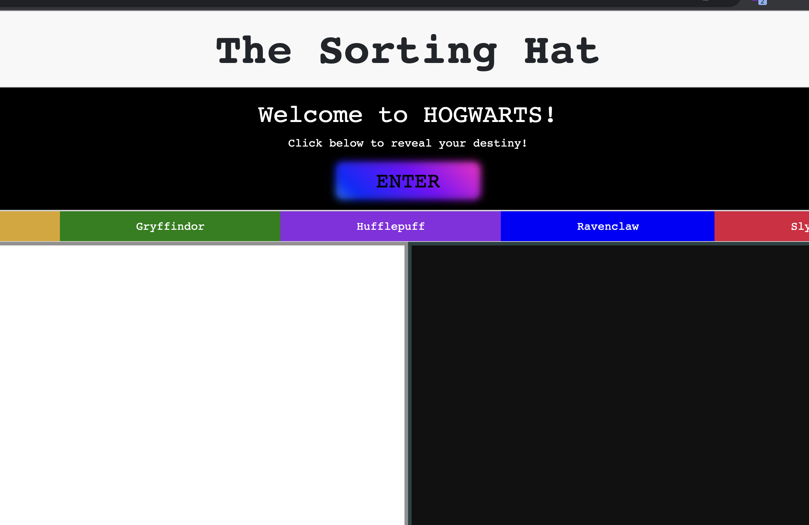
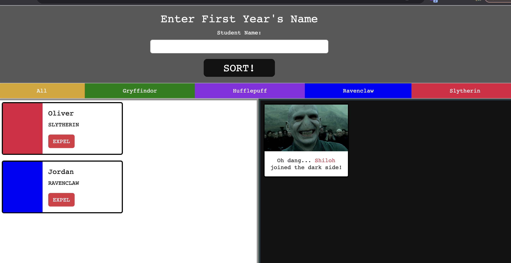

# The Sorting Hat

## Overview:
The Sorting Hat app allows users to enter their name into the sorting hat and get randomly assigned to a Hogwarts House. You are able to expel students and send them over to the dark side.

## Link to project :
git@github.com:hollyann-smith/INDIVIDUAL-PROJECT-sorting-hat.git

## Description of the user:
- Ideal for user who needs to make organize catagories randomly.

## List of features:
- Form appears on DOM with click of a button.
- Type new student name in form and submit to render new student card on DOM. New student card includes random house assignment and coordinating color.
- Row of buttons to allow students to be sorted by houe assignment.
- Seperate section on page to send expelled students to - rendering a new card for them.

## Screenshots of your project:

## List of contributors:
https://github.com/hollyann-smith/

## Link to Loom video walkthrough: 
